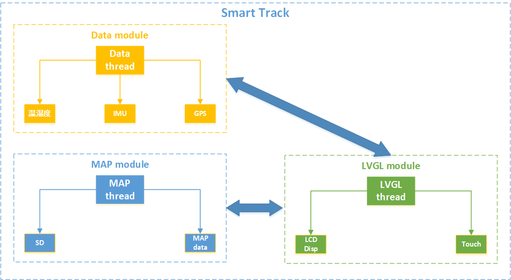
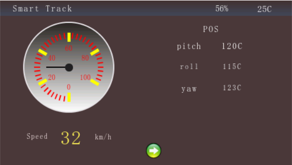
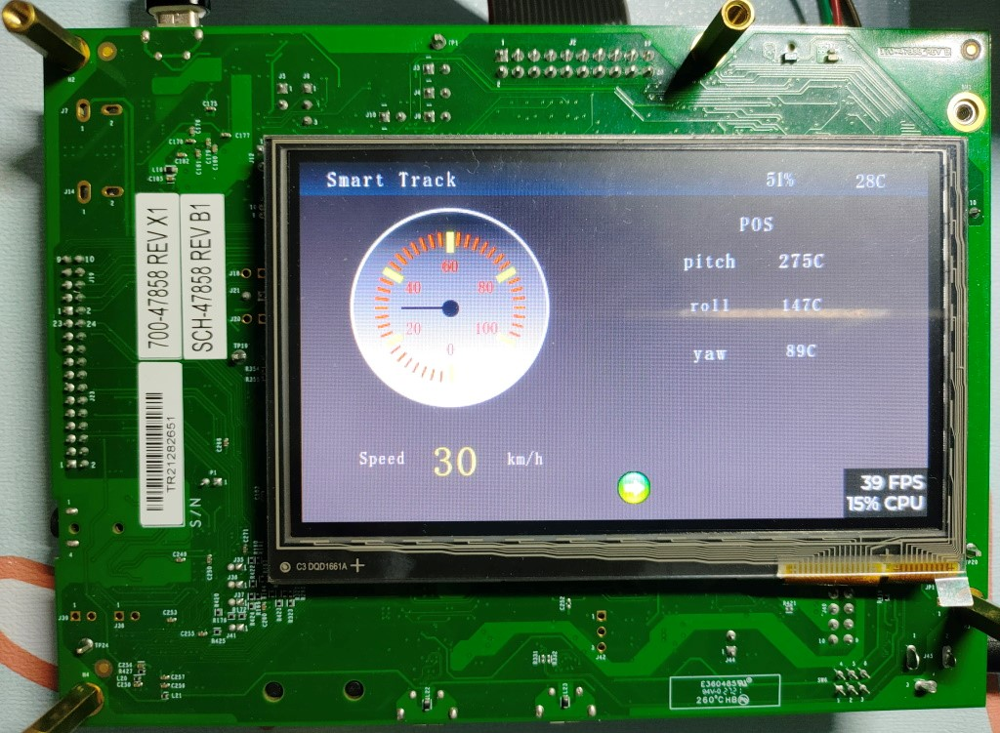
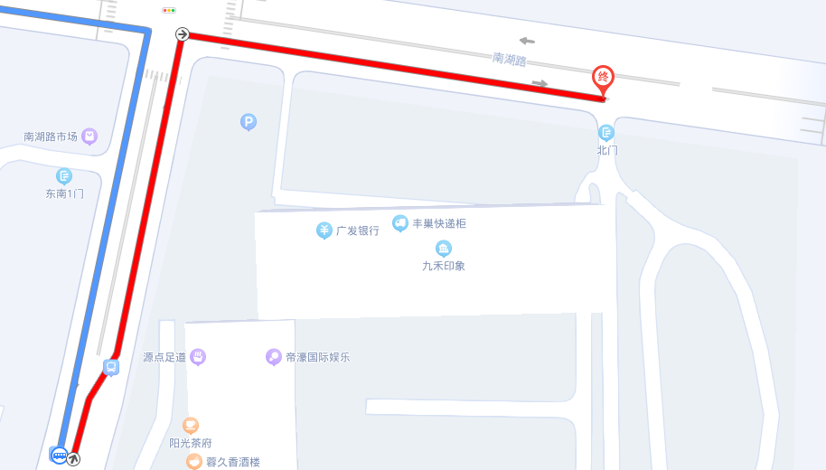

# Smart Track

**中文** | [English](README_en.md)

## 1 介绍
Smart Track主要用于室外导航，支持记录和显示实时轨迹以及导出标准 GPX 格式的轨迹文件。

Smart Track主要基于RT-thread开发的，采用NXP的i.MX RT1060 EVKB开发板作为主控，该开发板的核心为i.MX RT1060跨界处理器，配备Arm®Cortex®-M7内核的恩智浦先进实施。该内核运行速度高达600 MHz，可提供较高的CPU性能与极佳的实时响应。

Smart Track主要由三部分构成：数据子模块、地图子模块、LVGL模块。数据子模块为整个系统提供基础数据：温湿度、GPS和姿态信息；地图子模块主要根据用户需求实时显示导航，当然还可使用SD卡存储离线地图，LVGL模块实时显示地图信息，用于信息系交互。

## 2 系统架构

Smart Track系统整体架构如图所示。

## 3 开发环境

硬件：IMX1060-EVKB, GPS, AHT10, LCD, SD卡等
RT-Thread版本：RT-Thread V 4.1.1
Keil：V5.30
LVGL：V8.3.1

## 4 软件实现说明
**第一部分：数据采集**
上电之后完成板级初始化，接着初始化传感器，数据采集完成后，LVGL线程即可获得相应数据填充到相应位置。

**第二部分：导航**

## 5 功能演示
演示截图如下：

 

 

 

## 6 代码地址

代码地址：

[SmartTrack](https://github.com/Ouxiaolong/SmartTrack)

